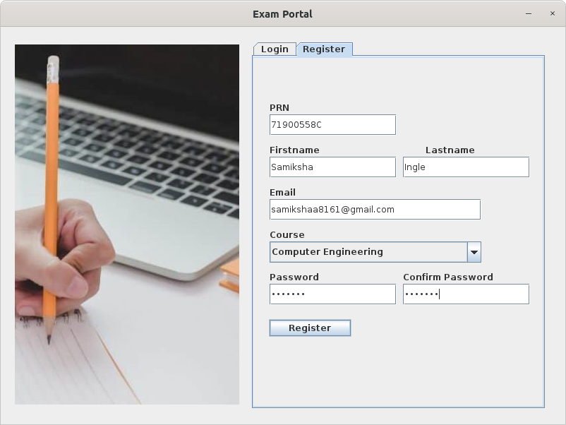
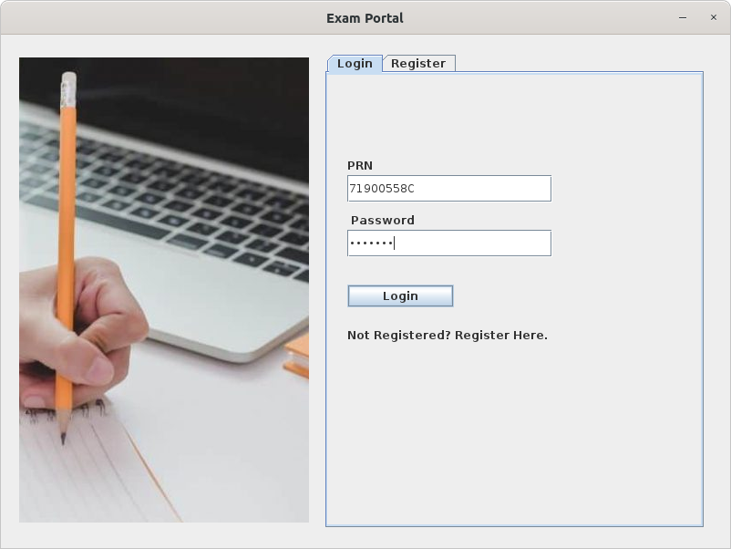
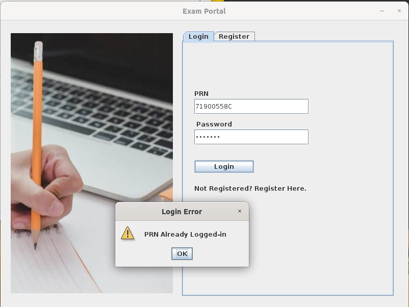
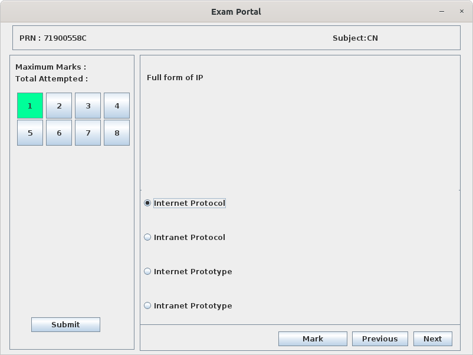
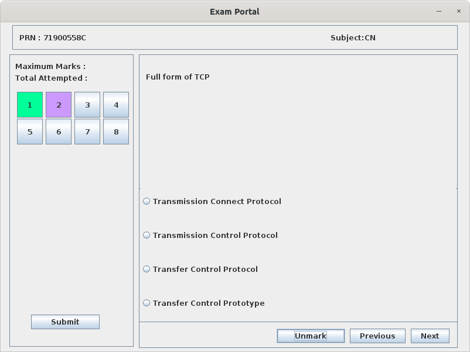
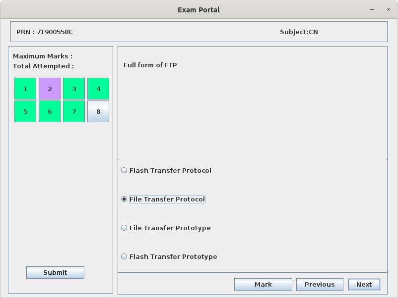
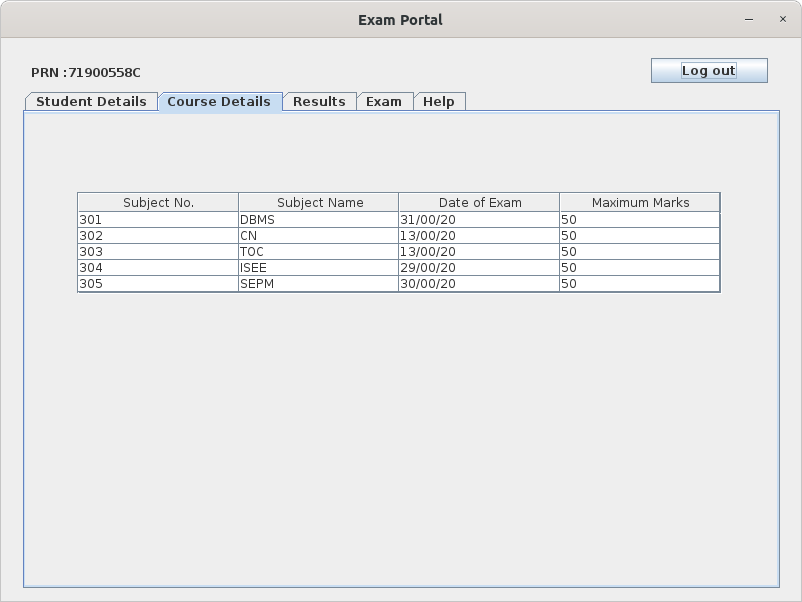
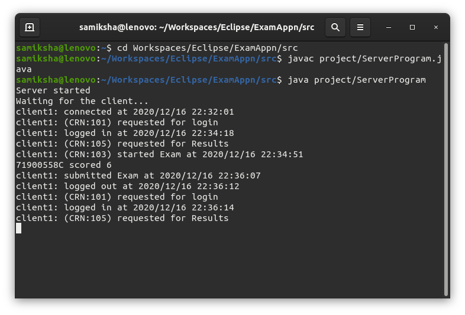
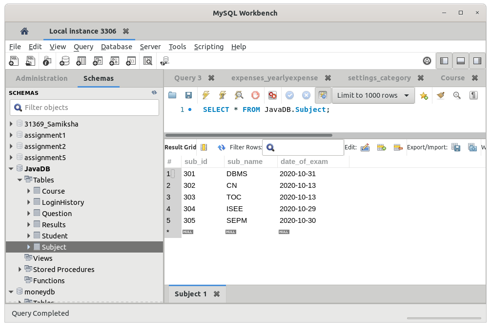

# ExamApp in Java

This is a Desktop application for taking MCQ text of students. Written completely in Java, the application makes sure that the qquestions present in one session (One time slot) are not repeated in the coming sessions (upcoming time slots). It uses various Java Concepts like-

i)    Collections
ii)   Exception Handling 
iii)  Serialization
iv)   Socket Programming
v)    Multithreading

It uses Swing for GUI and Mysql for Database, to which connection is done through JDBC. This project helps one understand the above java concepts by taking into consideration a use-case scenario. It is helpful for students who have just started learning Java and want to understand how these basic concepts can be applied in a project.

1). Registration Window

2). Login Window

3). Error Message when User tries to log-in multiple times

4). Exam Window (Attempted Question No. is highlighted with Green)

5). Exam Window (Marked Question No. is highlighted with Purple)

6). Exam Window (Simple and Clean GUI with Easy navigation)

7). Course Details Window

8). Server Terminal Window

9). MySQL Workbench Snap

